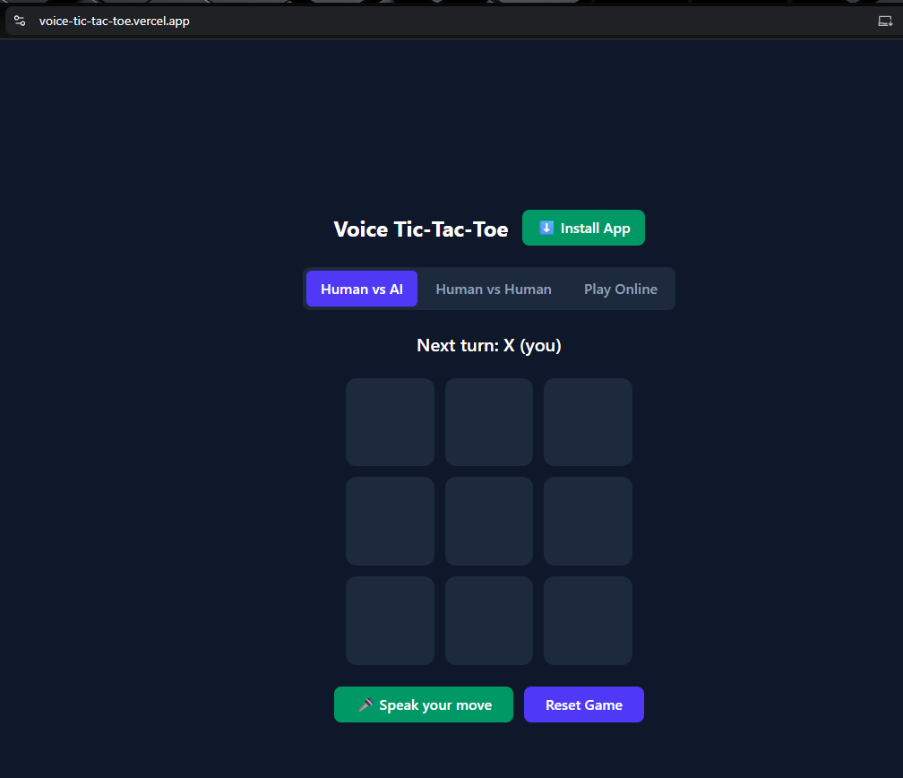

# 🎙️ Voice Tic-Tac-Toe

Play Tic-Tac-Toe with your voice — no clicking, no typing. Say your move, and an AI opponent (or a real person, live over WebSockets) plays back.

**🔗 Live app:** https://voice-tic-tac-toe.vercel.app/



---

## What it does

- 🎤 **Talk to play** — click "Speak" once, then just say things like *"top right"* or *"center"*. The mic stays open and listens automatically on your turn.
- 🧠 **Understands mishears** — browser speech recognition isn't perfect. A phonetic + Levenshtein fuzzy-matching layer catches things like *"bottom write"* → *bottom right* before they break the game.
- 🔊 **Talks back** — every move, invalid command, and win/loss/draw is spoken out loud via the browser's Text-to-Speech.
- 🚫 **No self-listening** — the app pauses the mic before it speaks and only reopens it after speech finishes, so it never mishears itself.
- 🤖 **Real AI opponent** — moves are generated by an LLM (Groq Llama 3.3 70B or OpenAI GPT-4o-mini) using structured function calling, not hardcoded logic.
- 👥 **Play a friend online** — create a room, share the code, and play in real time over WebSockets.
- 📱 **Installable** — it's a PWA, so it can be added to your home screen and used like a native app.

---

## Tech stack

**Frontend**
- React 19 + Vite
- Tailwind CSS 4
- Web Speech API (recognition) + SpeechSynthesis API (TTS)
- WebSocket client for real-time multiplayer
- vite-plugin-pwa for installability

**Backend**
- FastAPI + Uvicorn
- Groq (Llama 3.3 70B) / OpenAI (GPT-4o-mini) via function/tool calling
- WebSocket-based in-memory room manager for multiplayer

The frontend never talks to Groq/OpenAI directly — every AI move request is proxied through FastAPI, so API keys stay server-side.

---

## How a move actually happens

```
You say "bottom right"
        │
        ▼
Web Speech API transcribes it (client-side, no server round trip)
        │
        ▼
voiceParser.js normalizes + fuzzy-matches it against the board positions
        │
        ▼
Move sent to FastAPI → forwarded to the LLM with the current board state
        │
        ▼
LLM responds with a structured function call: place_mark(row, col)
        │
        ▼
Board updates, result is spoken back via TTS, mic reopens when speech ends
```

---

## Project structure

```
Voice_to_Voice/
├── frontend/          # React + Vite app
│   ├── src/
│   │   ├── components/   # Board, RoomLobby, MultiplayerBoard, ModeSwitcher...
│   │   └── lib/           # voiceParser, tts, apiClient, multiplayerClient, gameLogic
│   └── vite.config.js
├── backend/           # FastAPI app
│   ├── app/               # main.py, rooms.py, helpers.py
│   └── agents/voice-app/  # LLM system prompt + function-calling schema
```

---

## Running it locally

**Backend**
```bash
cd backend
python -m venv .venv
source .venv/bin/activate      # Windows: .venv\Scripts\Activate.ps1
pip install -r requirements.txt
uvicorn app.main:app --reload --port 8000
```
Add your keys to `backend/.env`:
```env
GROQ_API_KEY="gsk_..."
OPENAI_API_KEY="sk-..."
```

**Frontend**
```bash
cd frontend
npm install
npm run dev
```
Runs at `http://localhost:5173`. Use Chrome, Edge, or Brave for the best Web Speech API support.

---

## Credits

Built by **[Anirban Das](https://github.com/anirbandas-01)** (frontend, React/Vite/Tailwind, WebSocket multiplayer client, PWA setup, and frontend↔backend integration) and **Abhisek Kundu** (backend, AI pipeline, voice normalization logic).
